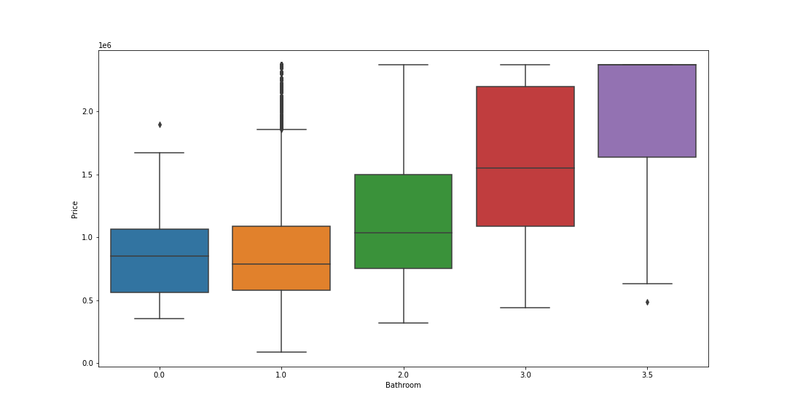
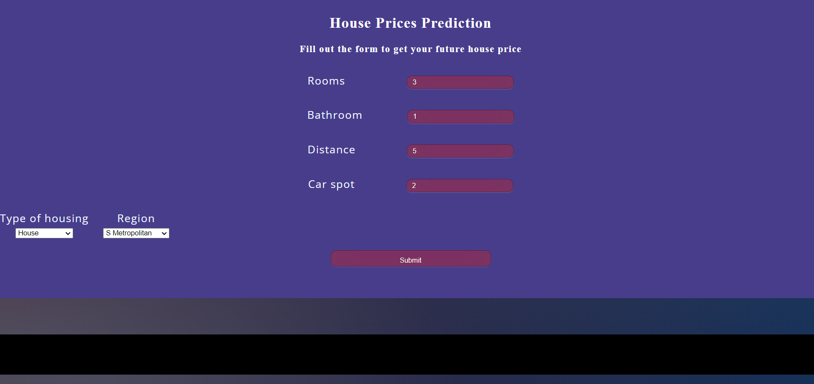

# Housing Price Prediction: :house_with_garden:
[Melbourne, Australia Housing Price Prediction](https://melbourne-housing.herokuapp.com/)

## Table of Contents
01. [Reason for our project](#reason)
02. [Data Source](#source)
03. [Technologies](#tech)
04. [Approach](#approach)
05. [Extract, Transform, Load](#etl)
06. [Exploratory Data Analysis](#eda)
07. [Regression Model Results](#models)
08. [Best model](#model)
09. [The Website](#site)
10. [Going Forward](#forward)
11. [Contributors](#team)

## Reason for our project: :thinking:
For the average consumer, finding appropriate housing within a set budget can be a daunting task. Predicting housing prices are expected to help people who plan to buy a house so they can know the price range in the future and be able to plan their finances. Housing price predictions are also beneficial for property investors to know the trend of housing prices in a certain location.

## Data Sources: :books:
This is a house prices dataset for Melbourne, Australia from September 2017 to September 2019. This data was scraped from publicly available results posted every week from Domain.com.au. The dataset includes address, type of real estate, suburb, method of selling, rooms, price, real estate agent, date of sale, property size, land size, council area and distance from the Central Business District. From the dataset provided, we chose to clean our data to focus on the important features to be used within our machine learning models to determine which would give us the best predicted housing price.

- [Kaggle: Melbourne Housing Market](https://www.kaggle.com/anthonypino/melbourne-housing-market)

## Technologies: :building_construction::hammer_and_wrench:
- Jupyter Notebook
- Python
- Numpy
- Pandas
- Seaborn
- Matplotlib
- SciPy
- PostgreSQL/ SQLAlchemy
- Scikit-learn
- Flask
- HTML/CSS
- Heroku

## Approach: :computer:
01. Identify data source
02. Collect and clean Melbourne, Australia housing data
03. Normalized target feature for better model results
04. Create charts and graphs using Pyplot
05. Load data into PostgreSQL
06. Transform data to be fitted into models
07. Test varying machine learning models and determine best option
08. Customize HTML and CSS for final application
09. Develope Flask application for model deployment
10. Visualize dashboard in Heroku

## Extract, Transform, and Load: :magic_wand:
The data was provided to us in a CSV. We checked to verify the datatypes, dropped any columns we didn't need and, renamed the columns we kept. We also checked for any null values in the dataset and dropped them. Once our data checked out, we made sure not to have any duplicate data values.

## Exploratory Data Analysis: :mag::bar_chart:
As we've guaranteed our data to be cleaned, we proceeded to our data exploration. We used Matplotlib and Seaborn to do visualizations and visualized many different aspects of our data to see how it reads.

We normalized our target feature to get a better outcome on our predictions

We checked the relationship of price with bedrooms and bathrooms

## Regression Models Results: :nerd_face:

## Best model: :trophy:

## The Website: :electron:

## Going Forward: :bulb:
- Visualize data to show housing price trends on a map through an application such as Tableau
- ​Scrape more recent data and see if the trends and predictions hold true
- Update the look and feel of the website to make it more user friendly

## Contributors: :brain:

- [Marius Clark](https://github.com/Zone6Mars)
- [Darryl Connelly II](https://github.com/Connelito)
- [Yawavi Koudjonou](https://github.com/yawavi92)
- [Kyungchul Oh](https://github.com/KCOH)
